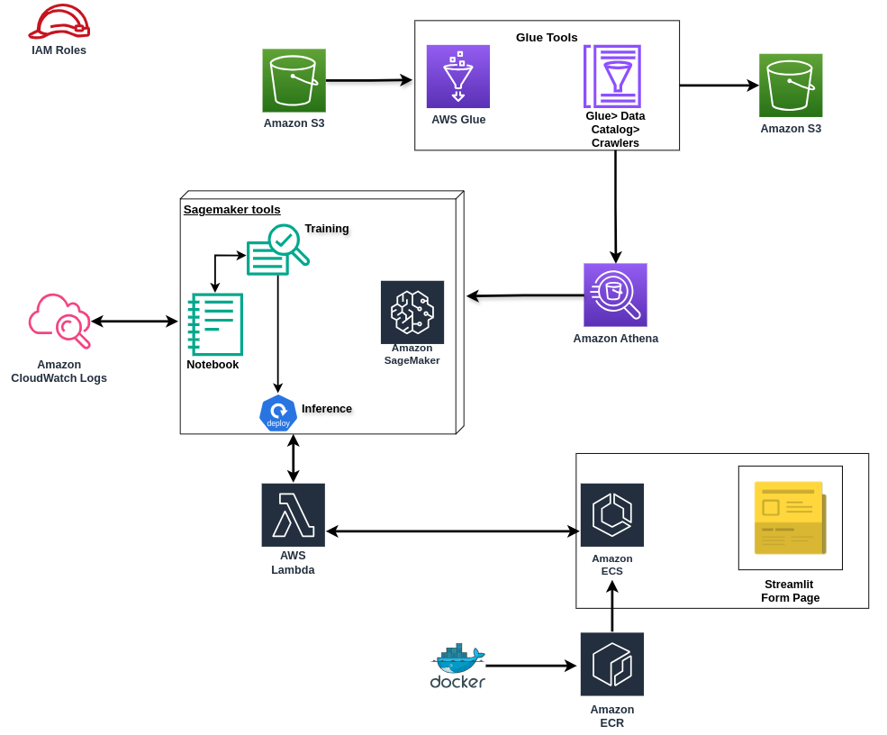

 
 

  

Este é um projeto fictício.
# Resumo sobre o projeto
Este foi um projeto pelo qual tive o primeiro contato com AWS console pelo curso da Comunidade DS. Entretanto, como é uma ferramenta paga, não é possível deixar roldando sem gerar custo. Então, para deixar a essência do projeto, foi necessário usar outras ferramentas, como Render, Docker, Flask e Streamlit.
Todas informações acerca dele foram publicadas no **[Medium](https://medium.com/@antoniorichardhc/resumo-do-projeto-aws-6b396f5674ea)**.

#### Observação:  

**Python 3.12.3** 

#### Contatos:
* [LinkedIn](www.linkedin.com/in/antonio-richard-hc)
* [Portfolio](https://antonioorichard.github.io/portfolio_projetos/)

